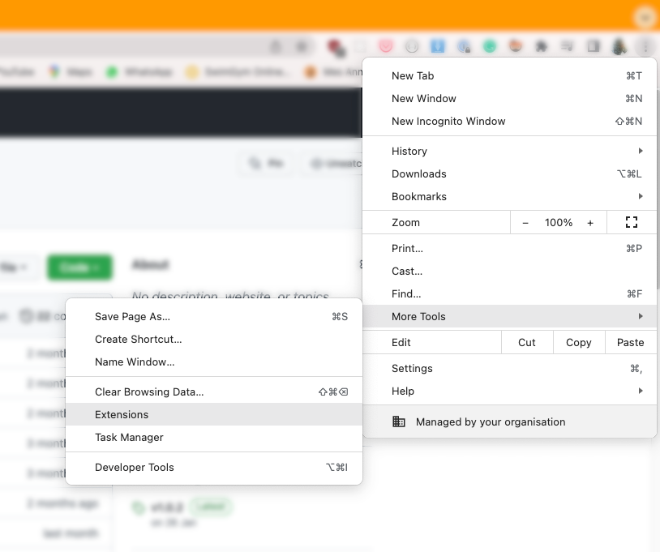
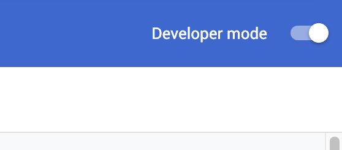
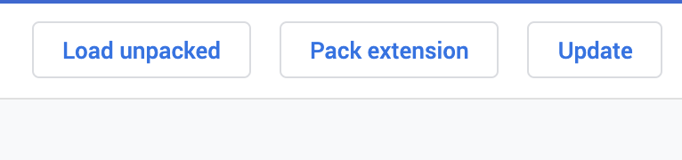
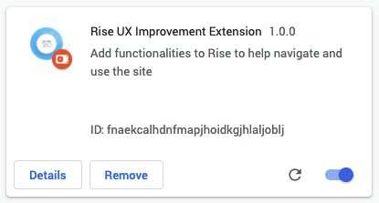
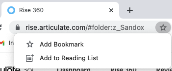
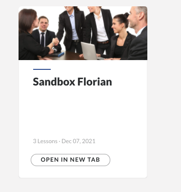
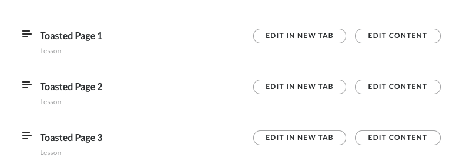

# Rise UX Improvement

## Disclaimer

This extension will alter the normal behaviour of rise, use at your own risk. 

# Installation

## With git

```
mkdir -p ~/.chrome-extensions/ && cd ~/.chrome-extensions/ && git clone https://github.com/florianpasteur/rise-ux-improvement.git
```

## Direct download

First download the `zip` file of the extension here : [rise-ux-improvement-chrome-extension.zip](https://github.com/florianpasteur/rise-ux-improvement/archive/refs/heads/master.zip)

Unzip the content of the zip at the location of your convenience, for example you could create a folder in your home: `~/.chrome-extensions/`

## Installation instructions

<video src="./docs/media/installation-instructions.mp4"></video>

From the menu, go to `More tools > Extensions` and activate the `Developer mode`





You're now able to load the extension, click on `Load unpacked` and select the location where you've unzipped the extension.



You should now see the extension in your list:




# Functionalities

Listed below the functionalities added by the extension

## Bookmark a folder 

Click on a folder then you can bookmark the page



## Open Courses in a new tab



## Open Lessons in a new tab



## Large sidebar

The sidebar for the folder selection is wider, useful for long folder names

